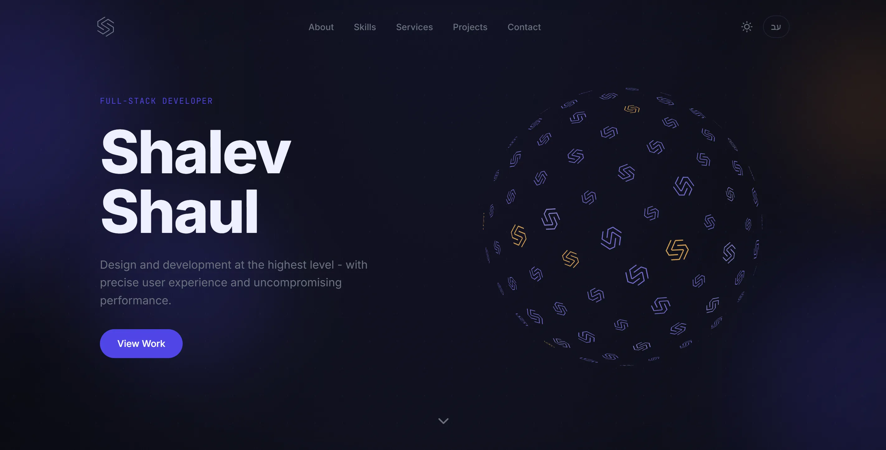

# Shalev Shaul - Portfolio

Personal portfolio of Shalev Shaul, a Full-Stack Developer with expertise in UI/UX, animation, and modern frontend architecture.

<a href="https://shalevshaul.dev">&nbsp;&nbsp;shalevshaul.dev</a>

---



---

## Tech Stack

<p>
  &nbsp;
  &nbsp;
  &nbsp;
  &nbsp;
  &nbsp;
  
</p>

| | |
|---|---|
| **Next.js 15** | App Router, Server Components, `generateMetadata` |
| **TypeScript** | Strict mode throughout |
| **Tailwind CSS v4** | CSS custom property design tokens, dark / light mode |
| **Framer Motion** | Scroll-driven animations, shared motion system |
| **React Three Fiber** | 3D WebGL hero canvas |
| **next-intl** | EN / HE bilingual + full RTL layout |
| **Vercel** | Deployment |

---

## Features

### 3D Interactive Hero
Live WebGL icosphere built with React Three Fiber - lazy-loaded, SSR disabled, with `PerformanceMonitor` for auto quality scaling on slow devices.

### Animations
Unified motion system via `lib/motion.ts`. All scroll reveals use shared variants with `whileInView`, stagger, and full `prefers-reduced-motion` support.

### Bilingual EN / HE
Full RTL layout support via `next-intl`. Every string lives in `/messages` - no hardcoded text in components.

### Dark / Light Mode
CSS custom property token system powered by `next-themes`. Dark is the primary aesthetic; light mode is a clean white counterpart.

### SEO
`generateMetadata` on every route, OpenGraph tags, JSON-LD `Person` schema, `hreflang` for EN/HE, sitemap and robots.txt.

### Accessibility
WCAG 2.1 AA compliant - logical heading hierarchy, keyboard navigable, `:focus-visible` rings, `aria-label` on all icon buttons, reduced-motion aware animations.

### Contact Form Automation
Submitting the contact form triggers a full n8n automation pipeline — no manual handling required:

- The sender receives an **instant confirmation email**
- A detailed **email notification** and a **Telegram message** are dispatched simultaneously for immediate awareness
- The submission is **logged to Google Sheets** in real time for a clean record of all inquiries
- A **follow-up reminder** fires automatically after 12 hours if the inquiry hasn't been responded to yet

### Analytics
- **Google Analytics** - page view and event tracking
- **Microsoft Clarity** - session recording and heatmaps

---

## Project Structure

```
app/[locale]/        # All routes under /en or /he
components/
  layout/            # Navbar, Footer, ThemeToggle, LangToggle
  sections/          # Hero, About, Skills, Services, Projects, Contact
  three/             # HeroCanvas (R3F, SSR disabled)
  ui/                # Button, SectionWrapper, ProjectRow, TechTag…
data/                # projects.ts, skills.ts
lib/                 # motion.ts (shared variants), skillIcons.ts
messages/            # en.json, he.json
public/projects/     # Project screenshots (.webp)
```

---

## Content

- **Projects** - `data/projects.ts`. `featured: true` → full-width row. `scrollDuration` controls hover-scroll speed per project.
- **Skills** - `data/skills.ts` (`skillsRow1` / `skillsRow2`).
- **Copy** - `messages/en.json` and `messages/he.json`.
